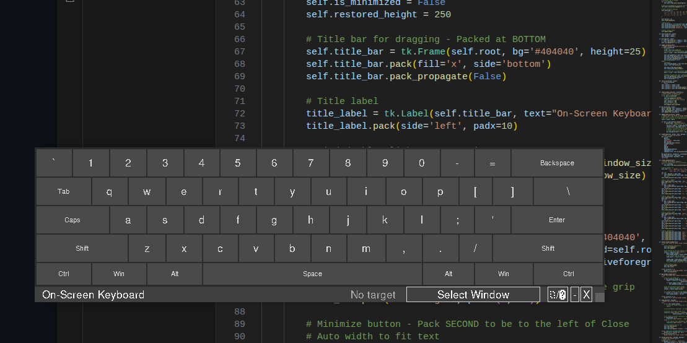
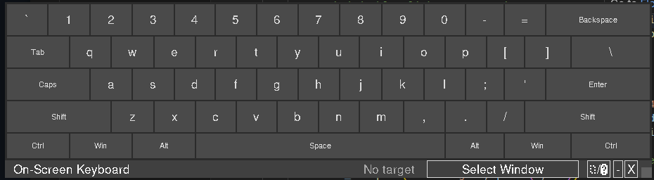

# Zorn On-Screen Keyboard

A modern, floating, resizable, and always-on-top virtual keyboard for Linux. Designed for touchscreens and mouse input, featuring a sleek interface with Dark/Light modes and window focus management.



## Features

-   **Always on Top:** Stays above other windows for easy access.
-   **Resizable:** Dynamically resize the keyboard to fit your screen. Double-click the title bar to reset to default size.
-   **Theme Support:** Switch between **Dark Mode** (default) and **Light Mode** instantly.
-   **Window Focus Management:** Select a target window to send keystrokes to, ensuring input goes where you want it.
-   **Compact Design:** Minimalist interface with auto-hiding controls and optimized layout.
-   **System Integration:** Uses `xdotool` to simulate natural keystrokes.



## Prerequisites

This application is built for **Linux** systems running X11. It relies on `xdotool` to simulate keyboard input.

### System Dependencies

You need to install `xdotool` on your system.

**Debian/Ubuntu:**
```bash
sudo apt-get update
sudo apt-get install xdotool
```

**Fedora:**
```bash
sudo dnf install xdotool
```

**Arch Linux:**
```bash
sudo pacman -S xdotool
```

## Installation Guide (Conda)

Follow these steps to set up the environment using Conda.

### 1. Install Conda

If you haven't already, install [Miniconda](https://docs.conda.io/en/latest/miniconda.html) or Anaconda.

### 2. Create the Environment

Create a new Conda environment with Python 3.13.

```bash
conda create -n zorn-keyboard python=3.13
```

### 3. Activate the Environment

```bash
conda activate zorn-keyboard
```

### 4. Install Application Dependencies

The application uses standard Python libraries (`tkinter`, `subprocess`, `threading`). However, `tkinter` is sometimes not installed by default in minimal environments.

```bash
# In most Conda setups, tk is included or can be installed:
conda install tk
```

Alternatively, on Debian/Ubuntu systems, you might need the system package if the Conda one isn't sufficient:
```bash
sudo apt-get install python3-tk
```

## Usage

1.  **Activate the environment** (if not already active):
    ```bash
    conda activate zorn-keyboard
    ```

2.  **Run the application:**
    ```bash
    python floating_keyboard.py
    ```

3.  **Using the Keyboard:**
    -   **Select Window:** Click "Select Window" and click on the window you want to type into. The status bar will update to show the target.
    -   **Type:** Click keys on the virtual keyboard.
    -   **Resize:** Drag the bottom-right corner to resize. Double-click the title bar to reset.
    -   **Theme:** Click the `☀/🌙` button to toggle Dark/Light mode.
    -   **Minimize:** Click `-` to minimize to the bottom bar.
    -   **Close:** Click `X` to exit.

### Alternative Sarak Usage

You can also use the provided `start_app.sh` script to easily launch the application without manually activating the environment each time.

Make the script executable:
```bash
chmod +x start_app.sh
```

Run it:
```bash
./start_app.sh
```

## Troubleshooting

-   **"Error: xdotool not found"**: Ensure you installed `xdotool` via your system package manager (apt, dnf, pacman).
-   **"ModuleNotFoundError: No module named 'tkinter'"**: Install `tk` in your conda env (`conda install tk`) or via system (`sudo apt-get install python3-tk`).
